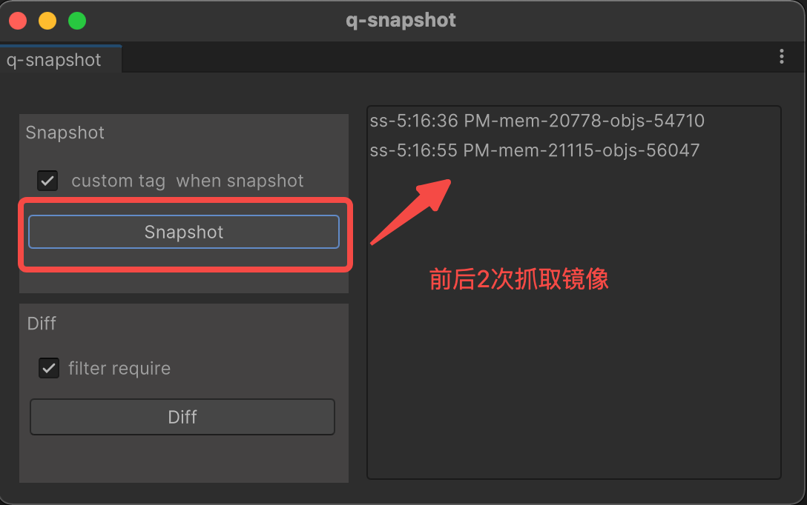
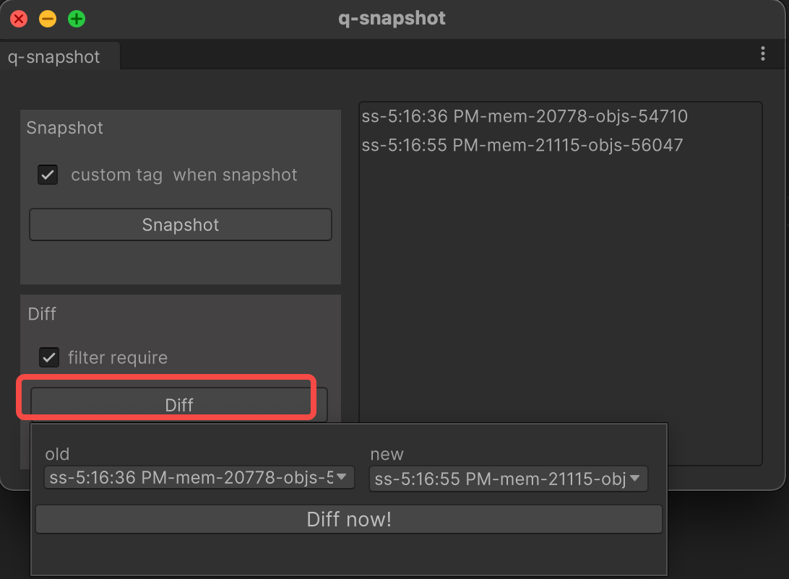

一个简单的Lua内存快照对比具，用来查找对象泄露。

### 适用环境：

unity+xlua

理论上通用于win+mac平台, 目前只在unity2021.3.6 + lua 5.2环境下测试过。

### 使用前准备：

把q-snapshot文件夹拷贝入Unity工程Assets目录。

Snapshot.cs最下面有2个静态函数，是用来取得当前运行中的LuaEnv对象和L指针，请根据自己项目修改这2个静态函数的实现代码。

public static System.IntPtr getLuaEnvL() {
    return GlobalLuaEnv.Instance.GetRawLuaL();
}

public static LuaEnv getLuaEnv() {
    return GlobalLuaEnv.Instance.LuaEnv;
}


### 使用方法：

先运行游戏

菜单中选中: 扩展/q-snapshot






镜像对比后会把结果输出一个临时文件txt，并自动打开。


结果大概如下：

```
summary:
leak objects count:13
filter required count:31


leak:[t]105553926394368
<--([val]FairyGUI.ScrollPane)--[R]


leak:[t]105553927449984
<--([val]time_1675502823)--[t]105553931877376<--([val]_targetEventPair)--[t]package.loaded[global.fire]<--([val]global.fire)--[t]package.loaded

```

对这个泄露对象的解读是这样的：

从最右边往左看，package.loaded[global.fire] 指向了一张表，这个表有个key叫  _targetEventPair, 通过该key找到的value是表[t]105553931877376， 这张表有个key=time_1675502823，正是这个key引用的值泄露了。


### 格式说明

```
子对象 <--(引用方式)-- 父对象 
```

引用方式的取值： 
   * upvalue引用([upv]) 
   * 表的key引用([key])
   * 表的key指向的value([val]key的描述)， key的描述如果是[n],表示它是数组key, 否则为字典key
   * metatable引用([meta])

对象的取值：
   * [t]表示table
   * [u]表示userdata
   * [f]表示函数

一些特殊的表： 
   * R: registry表
   * package.loaded: require过的对象都会放在这个全局表里


### 选项说明：

custom tag when snapshot:  在生成lua镜像的时候, 访问到lua函数, table对象的时候，会回调到snapshot.lua 里的对应函数，此时可以参考已有代码，对该对象做标记， 方便在后面diff结果时，容易判断是哪个对象泄露。
filter require:  勾上则在比较结果里过滤掉require的lua表，通常来说运行过程中require到的一些表不当做泄露处理。 


