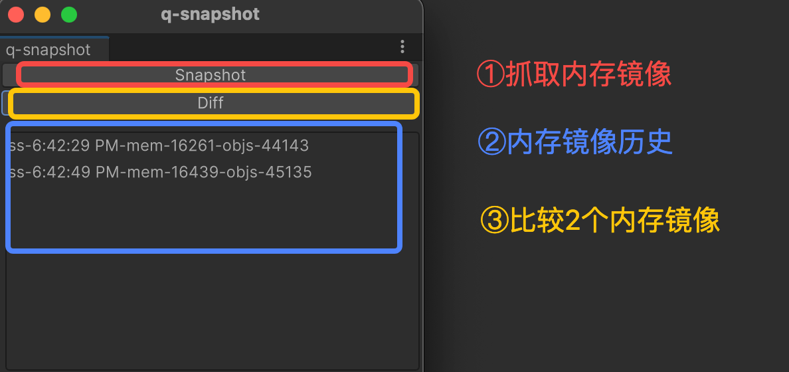

一个简单的Lua内存快照对比具，用来查找对象泄露。

### 适用环境：

unity+xlua

通用于win+mac平台

### 使用前准备：

把q-snapshot文件夹拷贝入Unity工程Assets目录。

Snapshot.cs最下面有2个静态函数，是用来取得当前运行中的LuaEnv对象和L指针，请根据自己项目修改这2个静态函数的实现代码。

public static System.IntPtr getLuaEnvL() {
    return GlobalLuaEnv.Instance.GetRawLuaL();
}

public static LuaEnv getLuaEnv() {
    return GlobalLuaEnv.Instance.LuaEnv;
}


### 使用方法：

先运行游戏

菜单中选中: 扩展/q-snapshot




镜像对比后会把结果输出一个临时文件txt，并自动打开。

结果大概如下：

```
summary:
leak objects count:105


leak:[t]105553238428864
<--([val]_attachLayers)--[t]105553173003328<--([val]loaded)--[t]105553173002176<--([upv])--[f]func:=[C]&line:-1<--([val]require)--[t]105553173001536<--([val][n]7)--[R]
```

对这个泄露对象的解读是这样的：

从最右边往左看， R(registry)表开始，
R[7]['require']是一个匿名函数,它的upvalue里匿名引用了table(105553173002176), 假设table为t,
那么t['loaded]['_attachLayers'] 指向了被泄露对象 [t]105553238428864


### 格式说明

```
子对象 <--(引用方式)-- 父对象 
```

引用方式的取值： 
   * upvalue引用([upv]) 
   * 表的key引用([key])
   * 表的key指向的value([val]key的描述)， key的描述如果是[n],表示它是数组key, 否则为字典key
   * metatable引用([meta])

对象的取值：
   * [t]表示table， 特殊情况下如果table含有 __class_name这个key, 将自动识别为[class]
   * [u]表示userdata
   * [f]表示函数


